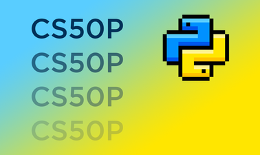

# 
 CS50P Final Project

This repo contains the content of my final project for [__CS50’s Introduction to Programming with Python__](https://www.edx.org/course/cs50s-introduction-to-programming-with-python) course.

* project.py
* test_project.py
* README.md
* project.mp4